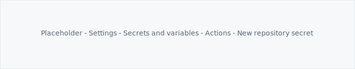
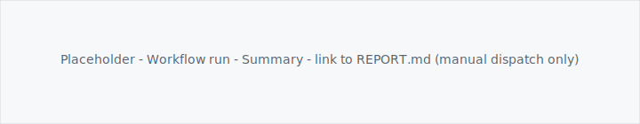

🇩🇪 **[Deutsche Version](README.de.md)**

<div align="center">


# ISTA EcoTrend Reporter

[](https://github.com/gabrielbahniuk/ista-ecotrend-exporter/actions/workflows/report.yml)
[](https://www.python.org/)
[](LICENSE)

</div>

<!-- ista-report-nav:begin -->
<h3 align="center"><a href="./generated/reports/REPORT.md">Open Latest Report →</a></h3>
<p align="center"><sup>Last updated · 03.05.2026 11:51</sup></p>
<!-- ista-report-nav:end -->

ISTA EcoTrend shows how heating and hot-water use add up over the year. This template uses GitHub Actions to sign in the same way the app does, then commits Markdown reports, charts, and a CSV under `generated/`. A private repo keeps the data off the public internet.


## Quick setup

1. Click **Use this template** → **Create a new repository**.
2. Pick a name, optional description, and **Private** visibility.
3. Open **Settings** → **Secrets and variables** → **Actions**.
4. Add two repository secrets (names must match exactly):

   | Name | Value |
   |------|--------|
   | `ISTA_EMAIL` | your ISTA EcoTrend login email |
   | `ISTA_PASSWORD` | that account’s password |

5. Open **Actions** → **ISTA EcoTrend Reporter**.
6. Click **Run workflow** → choose your default branch (often `main`) → **Run workflow**.

When the job finishes and the bot pushes, open **`generated/reports/REPORT.md`** on your branch, or browse **`generated/reports/`** for the index and per-year pages.

Runs you start with **Run workflow** also get a **Summary** on the workflow run with a direct link to `REPORT.md` after the push. Runs triggered by the **schedule** skip that Summary step (it is wired for `workflow_dispatch` only in [.github/workflows/report.yml](.github/workflows/report.yml)); open the file tree or `REPORT.md` yourself, or change the workflow if you want the same banner for cron.

### Scheduled runs

The workflow also runs on the **18th of every month at 06:00 UTC**. Adjust the cron in [.github/workflows/report.yml](.github/workflows/report.yml) if you like. ISTA’s consumption email usually lands between the 13th and 16th.

<details>
<summary>Optional: GitHub UI reference (replace the SVGs in <code>docs/tutorial/</code> with real screenshots if you prefer)</summary>

**Settings** → **Secrets and variables** → **Actions**:



**Actions** → **ISTA EcoTrend Reporter** → **Run workflow**:


After a manual run, latest run → **Summary** (link to `REPORT.md` only for manual runs):



</details>

## Disclaimer

- Data is fetched with the unofficial library **`pyecotrend-ista`** ([upstream](https://github.com/Ludy87/pyecotrend-ista); pinned via git in [`requirements.txt`](requirements.txt)). ISTA may change endpoints or terms. Use at your own risk.
- This is not an official ISTA product, hosted database, or live dashboard. It is automation that commits reports into git in your fork.
- Do not photograph or paste `ISTA_EMAIL` / `ISTA_PASSWORD` values into issues or screenshots.

## Local development (optional)

```bash
python3 -m venv .venv
source .venv/bin/activate   # Windows: .venv\Scripts\activate
python -m pip install -U pip
python -m pip install -r requirements.txt
cp .env.example .env
# edit .env: ISTA_EMAIL and ISTA_PASSWORD
set -a && source .env && set +a
python -m src.pipeline.report
```

| Variable | Purpose |
|----------|---------|
| `ISTA_EMAIL`, `ISTA_PASSWORD` | ISTA login for a live API fetch |

```bash
python -m pytest -q
```

## Security

- Never commit `.env` or credentials in tracked files.
- Rotate the ISTA password if it was ever exposed.
- Use a **private** repository if you do not want consumption data public.
